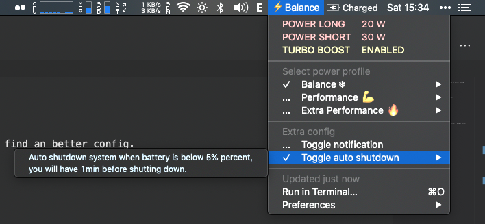

# SmartCPU

> MacOSX Power Management Script

- Auto change power usage of cpu
- This script may cause panic, dead cpu due to your config.
- In care your system is not stable, please run uninstall and reboot then find an better config.

# Info

- Ver 2.3
- Init auto script for plug-in adapter and battery mode
- This script will control your cpu power such as:
  - Long term power
  - Short term power
  - Turbo
  - Undervolt
- Auto switch profile on low battery
- Auto shutdown on critical battery
- Base on VoltageShift kext by @sicreative
    - You can read more info at here: https://github.com/sicreative/VoltageShift
- Add 5 profile to be selected
    - 2 Profile working on battery mode
    - 3 Profile on plug-in mode

# Changelog

## Ver 2.3

- Optimize code, do not change value on sleeping
- Allow auto shutdown when low battery on sleeping
- Config now store on config.sh file
- Add voltage status to plugin
- Add CPU cache offset



## Ver 2.0

- Add auto change profile on low battery
- Add auto shutdown on critical battery
- Toggle on/off notification
- Toggle on/off auto shutdown
- Redesign bitbar plugin

## Ver 1.6

- Fix auto load value on reboot

## Ver 1.6

- Fix auto load value on reboot

## Ver 1.5

- Fix value not applied
- Add more profile
- Add select profile through Bitbar

# Installation

- Pull source code
- Changing your cpu's value at config.sh file
- Testing it by using command "bash auto.sh"
- Hard work for about 30min for checking stable state
- When it stable run "bash install.sh" to make it run at boot
- Install Bitbar at https://github.com/matryer/bitbar
- Select `plugin` as bitbar's plugin folder or copy all file in plugin to bitbar's plugin folder
- To remove, use "bash uninstall.sh".

# Example `config.sh` for my 9300H Dell Ins 7591

```bash
######### BEGIN OF YOUR CONFIG #########
# All power value should be below your CPU TPD, you can not overclock cpu with this value
# Find your value in intel page like this
# 9300H: https://www.intel.vn/content/www/vn/vi/products/processors/core/i5-processors/i5-9300h.html

# EXTRA BATTERY PROFILE 0               <EXTRA LOW BATTERY USAGE>
EX_BATTERY_LONG="5"         # Long period power usage of cpu W
EX_BATTERY_SHORT="7"        # Short period power usage of cpu W
EX_BATTERY_TURBO="0"        # Intel turbo on/off <Off>
# BATTERY USAGE PROFILE 1               <LOW BATTARY USAGE AND COOL>
BATTERY_LONG="7"            # Long period power usage of cpu W
BATTERY_SHORT="10"          # Short period power usage of cpu W
BATTERY_TURBO="0"           # Intel turbo on/off <Off>
# NORMAL USAGE PROFILE 2                <SMOOTHEST AND COOL>
NORMAL_LONG="20"
NORMAL_SHORT="30"
NORMAL_TURBO="1"
# PERFORMANCE USAGE PROFILE 3           <PERFORMANCE COOL>
PERFORMANCE_LONG="25"
PERFORMANCE_SHORT="35"
PERFORMANCE_TURBO="1"
# EXTRA PERFORMANCE USAGE PROFILE 4     <PERFORMANCE MAX>
EX_PERFORMANCE_LONG="40"
EX_PERFORMANCE_SHORT="60"
EX_PERFORMANCE_TURBO="1"
# SETTING AUTO PROFILE ON BATTERY LOW
BATTERY_LOW_PERCENT=20      # Setting percent when battery is low
BATTERY_LOW_PROFILES=0      # When battery low will setting this profile
# SETTING INIT PROFILE
BATTERY_PROFILE=1           # On battery will select this profile
PLUGIN_PROFILE=3            # On plugin adapter will select this profile
# UNDERVOLT
# Setting to undervolt CPU -> Colddown (mha)
# Config this must carefully, can damage your cpu ( set to 0 if you want to bypass )
CPU_VOLT="-125"
GPU_VOLT="-90"
CPU_CACHE_VOLT="-125"
######### END OF CONFIG #########
```

# Thanks

    @sicreative for his cpu's kext
